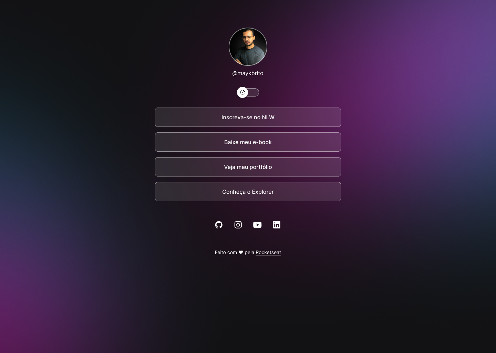

<h1 align="center">PÁGINA DE LINKS</h1>

  Página simples de links de redirecionamento para minhas redes de contato, com versão de tema em Dark e Light. 

  

## 👨‍💻 Tecnologias

- HTML e CSS
- Javascript
- Git e Github
